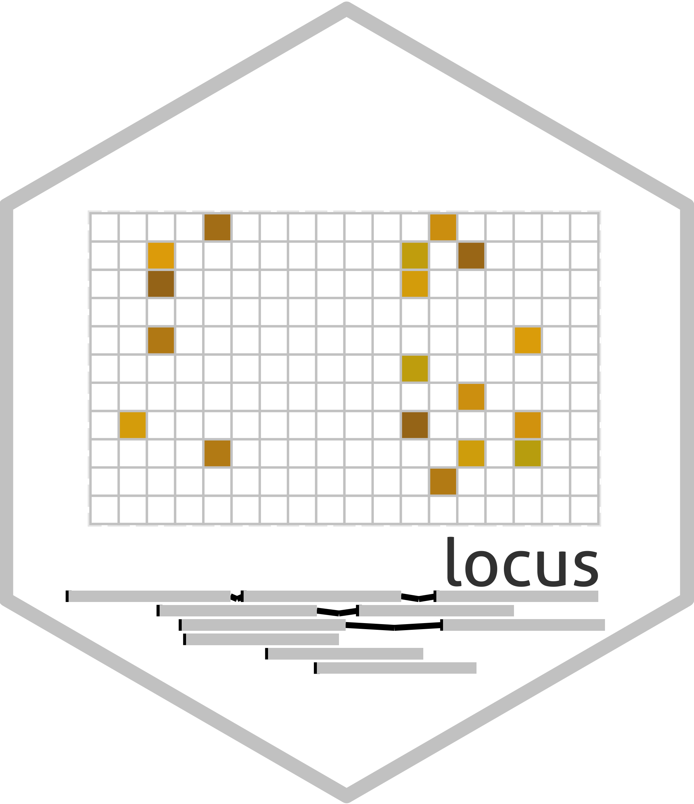

<!-- README.md is generated from README.Rmd. Please edit that file -->
<!-- First time: run usethis::use_readme_rmd() to create a pre-commit hook that 
prevents from committing if the README.Rmd has changed, but has not been 
re-knitted to generate an updated README.md -->

## LOCUS – Large-scale variational inference for Bayesian variable selection in multiple-response regression 

<!-- Run for the R CMD checks, run usethis::use_github_actions() to set up the pipeline, possibly modify the .yaml file and then: -->
<!-- [](https://travis-ci.org/hruffieux/locus) -->
<!-- [](https://github.com/hruffieux/locus/actions)  -->

[](https://www.gnu.org/licenses/old-licenses/gpl-2.0.en.html)
[](https://github.com/hruffieux/locus)
[](https://github.com/hruffieux/locus)
[](https://doi.org/10.1093/biostatistics/kxx007)

## Overview

**locus** is an R package providing efficient variational algorithms for
simultaneous variable selection of covariates and associated responses
based on multivariate regression models. Dependence across responses
linked to the same covariates is captured through the model hierarchical
structure (H. Ruffieux, A. C. Davison, J. Hager, I. Irincheeva,
Efficient inference for genetic association studies with multiple
outcomes, *Biostatistics*, 18:618–636, 2017).

## Warning

**This is a development branch**, it is not guaranteed to be stable at
any given time and features are subject to change. Please use the
[stable version](https://github.com/hruffieux/locus), unless you want to
test and report issues.

## Installation

To install, run the following command in R:

``` r
if(!require(remotes)) install.packages("remotes")
remotes::install_github("hruffieux/locus", ref = "devel")
```

## Algorithms

The algorithms for joint covariate and response selection provided in
**locus** implement inference for regression models with

- identity link;
- logistic link;
- probit link;
- identity-probit link.

Inference on models for group selection and based on a spatial Gaussian
process to encode the dependence structure of the candidate predictors
are also implemented. Moreover, covariate-level external information
variables can be incorporated to inform the selection.

## License and authors

This software uses the GPL v2 license, see [LICENSE](LICENSE). Authors
and copyright are provided in [DESCRIPTION](DESCRIPTION). Loris Michel
has also contributed to the development of this project.

Please cite the software using the following reference: H. Ruffieux, A.
C. Davison, J. Hager, I. Irincheeva, Efficient inference for genetic
association studies with multiple outcomes, *Biostatistics*, 18:618–636,
2017.

## Issues

To report an issue, please use the [locus issue
tracker](https://github.com/hruffieux/locus/issues) at github.com.
